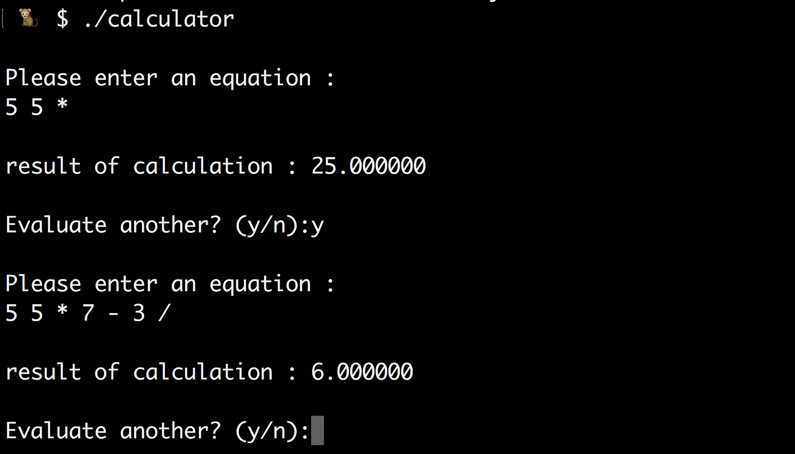

author : Alexander Harris
version : Feb 2017
Operating Systems, CS475

Homework 3 : Reverse Polish Notation Calculator

I have implemented the reverse polish notation calculator in a multi-file program written in C.
This calculator makes use of a stack to manage execution ordering of operations.
The stack is implemented using a linked-list style, not an array.
The stack allocates memory dynamically using malloc() and free()

I have also implemented the additional pow() function which is usable by using the '^' operator.
User entered values into an equation are able to be separated by spaces, tabs, or new-lines.

A make file is included to compile program in a correct ordering.
To run the program, navigate to the project directory and issue :
  $ make
... this should return :
>  ###########################################
>  ### Compiling Reverse Polish Calculator ###
>  ###########################################
>  ########### remove object files ###########
>  make clean
>  rm -f *.o calculator
>  ############# compile stack.c #############
>  make stack.o
>  gcc -Wall -c stack.c
>  ############# compile rpn.c #############
>  make rpn.o
>  gcc -Wall -c rpn.c
>  ############### compile all ###############
>  gcc -Wall -o calculator main.c stack.o rpn.o
>  ####### issue ./calculator to run #######

Next, issue '$ ./calculator' to execute the program.
This will launch a prompt where you will be requested to enter an equation.
Please ensure that the equation you enter is according to the reverse polish notation standard.

Here is some example input/output :

  Please enter an equation :
  2 10 ^

  result of calculation : 1024.000000

  Evaluate another? (y/n):y

  Please enter an equation :
  5 5 + 8 - 10 ^

  result of calculation : 1024.000000
